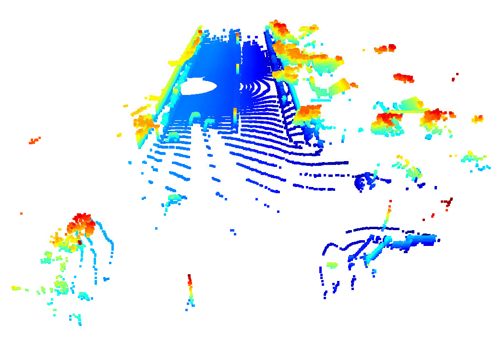

# 3D Object detection in LIDAR scans

## Section 1 : Compute Lidar Point-Cloud from Range Image

### Visualize range image channels
LIDAR data includes range measurements and reflected intensity measurements. In this activity, range channel and intensity channels of LIDAR are stacked together in one image as below. Top half is the range image, and bottom half is the intensity channel.

### Visualize LIDAR point cloud
Point cloud is generated by projecting the LIDAR range image into a 3D space. Then this point cloud is visualized in following figures as it is iterated over the consecutive frames, and rendered from different viewpoints. 

Point colour indicates the height of the point. For example red/brown indicates highest elavation and dark blue refers to the lowest elavation. As the point cloud is observed from different point of view, we can see different obstructed and visibility of the objects.

point cloud view #1

point cloud view #2

point cloud view #3

point cloud view #4

point cloud view #5

point cloud view #6

point cloud view #7

point cloud view #8

point cloud view #9

point cloud view #10

point cloud view #11

point cloud view #12

As it is observed in the below zoomed range image (top half - range channel, bottom half - intensity channel), it can be clearly observed in the intensity channel, vehicle main body, rear bumpers, tail lights, and head lights have high intensity values (more white). This should be related to high LIDAR reflection (e.g. head and tail lights) and larger continous surface area (e.g. vehicle main body and rear bumpers) of those. With these high responsive nature, main behicle body, bumpers, tail and head lights are good stable features for the detection algorithms.

## Section 2 : Create Birds-Eye View from Lidar PCL
### Convert sensor coordinates to BEV-map coordinates

Bird eye view (BEV) is generated from rendering the observation from the down looked view, referenced aroud the X,Y coordinates in sensor space. 

### Compute intensity layer of the BEV map

After projecting the LIDAR point cloud into the BEV, intenstiy channel BEV is generated by collecting the intensity value of each corresponding topmost point. Intensity values are normalized in the range of 0 to 255.

### Compute height layer of the BEV map

After projecting the LIDAR point cloud into the BEV, point height BEV is generated by collecting the height value of each corresponding topmost point. Height values are normalized in the range of 0 to 255.

## Section 3 : Model-based Object Detection in BEV Image
### Add a second model from a GitHub repo
In this exercise, we use FPN_RESNET prior trained ML model to detect vehicles in the provided point cloud.

### Extract 3D bounding boxes from model response

Using the pre trained FPN_RESENT model, now we are going to detect the vehicles and draw a bounding box around the detected vehicles. We will do this in following steps.

Step 1: Input point cloud

Step 2: Extracted BEV range channel

Step 3: Extracted BEV intensity channel 

Step 4: Inference of vehicles using FPN_RESNET pre trained model 

Legend: green bounding box - ground truth, red bounding box - inference detections

Step 5: Ground truth vs inference detections rendered into the camera and LIDAR intensity BEV views.

Legend: blue bounding box - ground truth, green bounding box - inference detections.

Another consecutive frames with ground truth and inference detections is shown below.

## Section 4 : Performance Evaluation for Object Detection

Performance of darknet model to detect vehicles in the LIDAR point cloud is evaluted using the ground truth labels and the algorithm detections.

### Compute intersection-over-union between labels and detections
By varying the intersection-over union (IOU), we can see how closely the inference detected objects overlap with the ground truth. 

### Compute precision and recall
With the pre-trained darknet model we achieve precision of 0.996 and recall of 0.813725.. which is quite good, it is worth to note false negatives could result in potential hazards, specially if those vehicles are in the proximity for a collision. 

By setting the flag configs_det.use_labels_as_objects to True, we can force the results to be taken from the ground truth lables, causing the resulting performance to be perfect (precision = 1.0 and recall = 1.0), and indicating the computations working fine, but this is not the actual detections.

Summary: In this project, we use LIDAR range/intenstiy scans with generated point clouds to detect vehicles in the surrounding. Using the pre-trained Darknet model, system achieved precision of 0.996 and recall of 0.813725. It is important to note, false negatives for the vehicles in the proximity could end up in potential collision. That's where multiple sensors could work together to eliminate or reduce the risk of specially the false negatives.