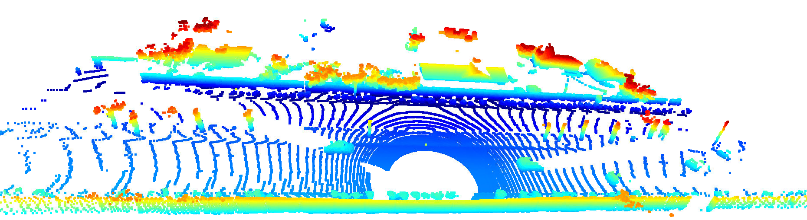
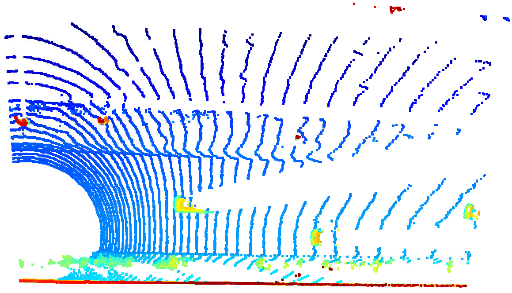
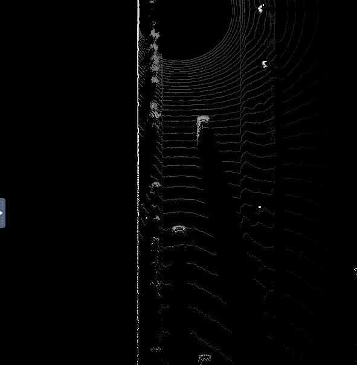
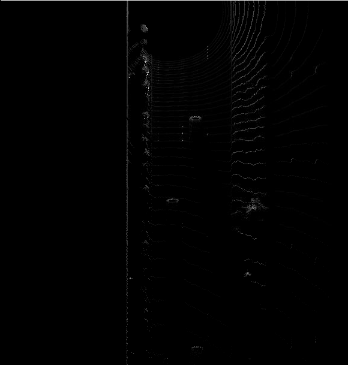
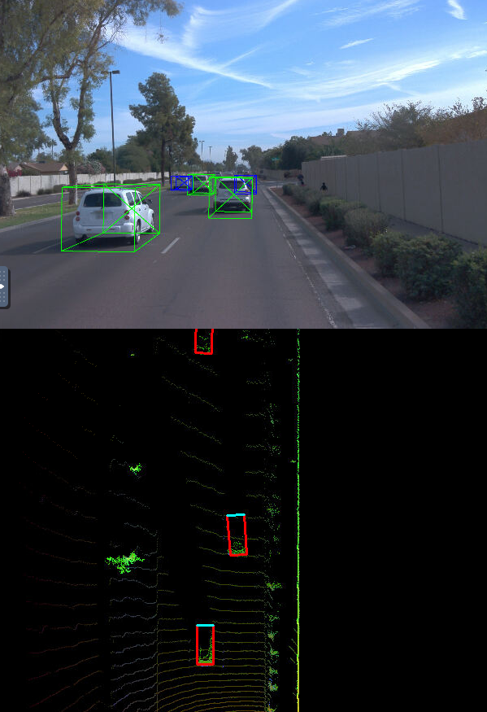
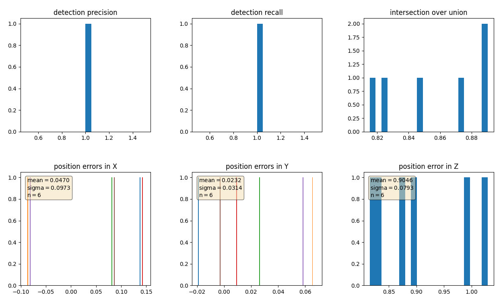

# 3D Object detection in LIDAR scans

## Section 1 : Compute Lidar Point-Cloud from Range Image

### Visualize range image channels
LIDAR data includes range measurements and reflected intensity measurements. In this activity, range channel and intensity channels of LIDAR are stacked together in one image as below.

### Visualize LIDAR point cloud

## Section 2 : Create Birds-Eye View from Lidar PCL
### Convert sensor coordinates to BEV-map coordinates

### Compute intensity layer of the BEV map

### Compute height layer of the BEV map

## Section 3 : Model-based Object Detection in BEV Image
### Add a second model from a GitHub repo
### Extract 3D bounding boxes from model response

## Section 4 : Performance Evaluation for Object Detection
### Compute intersection-over-union between labels and detections
### Compute false-negatives and false-positives
### Compute precision and recall

